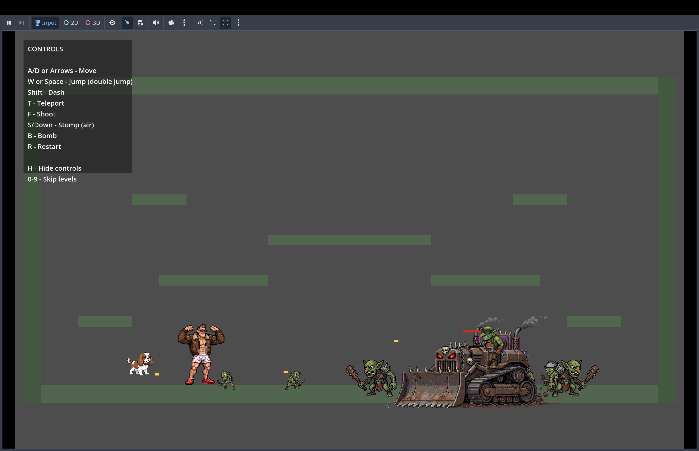

This is a basic platformer game inspired by Dungeon Crawler Carl, which I vibecoded using claude opus 4.5 in claude code over Christmas break, with some help from Alexis, especially on the platformer levels

You can play the game at https://dawndrain.github.io/carl_platformer/

The music is taken from https://www.youtube.com/watch?v=fxI8PNMcl10

The sprites were generated using nano banana

